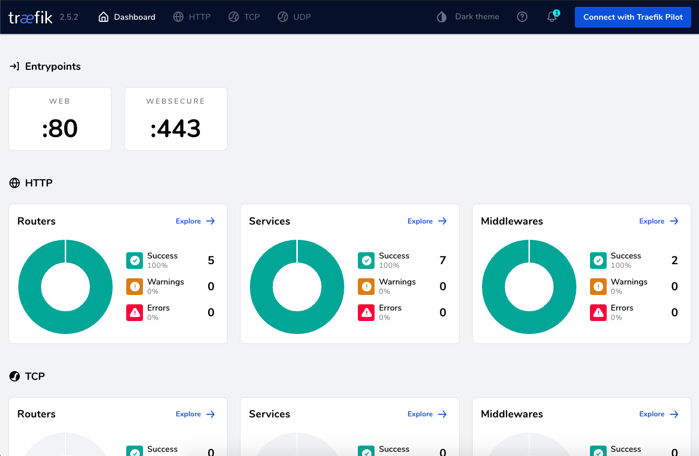

# Reverse Proxy using [Traefik](https://github.com/traefik/traefik)
Traefik template for hosting multiple containers on the same port via reverse proxy.

## Overview
- Uses the Docker version of Traefik (in `./reverse-proxy`)
- Includes two sample apps running a basic httpd server for testing (in `./site1`, `./site2`)
- Configured for secure dashboard and apps with auto-generated SSL certs
- Cert config is accessible via volume in `./reverse-proxy/letsencrypt/acme.json` when the container has been run

## Requirements
- [htpasswd](https://www.digitalocean.com/community/tutorials/how-to-set-up-password-authentication-with-apache-on-ubuntu-18-04-quickstart) 
- [Docker](https://www.docker.com/)

## Setup

#### Generate dashboard users
> htpasswd -c reverse-proxy/.users admin

Follow the prompts to generate the admin user. Repeat for any additional users required.

#### Configure labels in `reverse-proxy/docker-compose.yml`
- Cert generation email (`certificatesresolvers.myresolver.acme.email`)
- Dashboard domain (`traefik.http.routers.dashboard.rule`)

#### Debug Config
While debugging uncomment the following command args in `reverse-proxy/docker-compose.yml`:
- `# - "--log.level=DEBUG"`: to show more verbose log messages
- `# - "--certificatesresolvers.myresolver.acme.caserver=https://acme-staging-v02.api.letsencrypt.org/directory"`: to use letsencrypt staging server for test certificates

This will likely result in a `ERR_CERT_AUTHORITY_INVALID` when accessing URLs.  

They are uncommented by default. Remove or comment them again when you're ready to deploy. 

**Don't forget to clear the old test certificates and re-run the container after disabling the staging server:**
> cd ./reverse-proxy
 
> docker-compose down

> rm -rf ./letsencrypt

> docker-compose up -d --build

#### Configure each app's `docker-compose.yml` (example)
- Domain - replace `site1.example.com` in `site1/docker-compose.yml`
- Router - replace `site1` in all occurrences of `traefik.http.routers.site1` with the real site name in `site1/docker-compose.yml`

Repeat for each additional app.

**NOTE:** You can modify each app's `Dockerfile` and `docker-compose.yml` as long as they expose the port correctly and the Traefik labels are maintained and configured.

## Run

#### Start Traefik container
> cd ./reverse-proxy

> docker-compose up -d --build

> docker-compose logs -f

#### Start apps
> cd ./site1

> docker-compose up -d --build

> cd ./site1

> docker-compose up -d --build

#### Configure DNS records

Create ANAME DNS records pointing each configured domain to the IP address of server you're hosting Traefik on.

#### Access apps

###### Dashboard

- Open the configured dashboard domain in your browser.
- For example, if I configured `dev.example.com` as the dashboard domain, `https://dev.example.com`

###### Other apps
- Open the configured URL for each running app.
- For example, `https://site1.example.com`
